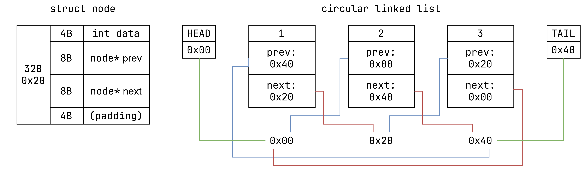

# Data Structures

## Circular Linked List

### C++ Port

- [x] Status
- [x] List
- [x] Append
- [x] Prepend
- [x] InsertAt
- [ ] Find
- [ ] RemoveLast
- [ ] RemoveFirst
- [ ] RemoveAt
- [ ] RemoveVal
- [ ] RemoveFirstVal
- [ ] TRAVERSAL
